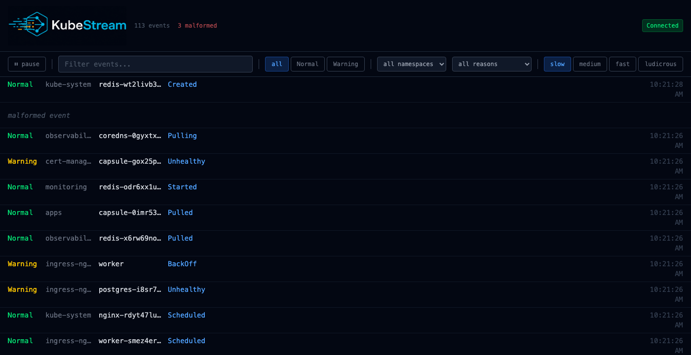

# KubeStream

A real-time Kubernetes event viewer. Streams events from a backend server, filters them by type, namespace, and reason, survives server restarts and malformed payloads, and persists the event buffer across page refreshes.



## Features

- **Live event stream** via SSE with automatic reconnect and exponential backoff
- **Gap fill on reconnect** — fetches missed events via REST cursor before resuming the stream
- **Facet filters** — filter by event type, namespace, and reason; dropdowns populate live from the stream
- **Exact-text search** — instant filter across all visible events
- **Event detail modal** — full event rendered as YAML, with prev/next navigation within the same `involvedObject`
- **Rate control** — switch the server emission rate between `slow`, `medium`, `fast`, and `ludicrous`
- **IndexedDB persistence** — event buffer and cursor survive a page refresh; stream resumes from where it left off
- **Malformed event handling** — invalid payloads are counted and shown as placeholder rows; the app never crashes
- **Virtualized list** — `react-window` fixed-size list handles thousands of events without frame drops
- **Connection badge** — live indicator: Connected / Reconnecting / Disconnected

## Stack

| Layer | Tech |
|---|---|
| Frontend | React 19, TypeScript strict, Vite 8, Tailwind CSS 4 |
| State | `useReducer` + rAF-batched SSE ingestion |
| Validation | Zod v4 |
| Virtualization | `react-window` + `react-virtualized-auto-sizer` |
| Persistence | IndexedDB (native API, no wrapper library) |
| Backend | Hono on Node.js |
| Unit tests | Vitest + Testing Library (34 tests) |
| E2E tests | Playwright (4 specs) |

## Getting started

```sh
# Install dependencies (covers both server and frontend workspace)
npm install
pnpm install

# Start the backend (listens on http://localhost:4000)
npm run start

# Start the frontend dev server
cd app
npm run dev
```

Open `http://localhost:5173`.

### Pointing the frontend at a different server

By default the frontend talks to the backend via Vite's dev proxy, which forwards requests to `http://localhost:4000`. In a production build there is no proxy, so set `VITE_SERVER_URL` at build time:

```sh
# Copy the example and edit it, or export the variable directly
cp app/.env.example app/.env

VITE_SERVER_URL=https://events.example.com npm run build
```

This affects both the SSE stream and the `/config` calls. The backend enables CORS for all origins, so no server-side change is needed for a cross-origin frontend.

## Running tests

```sh
# Unit tests
cd app && npm test

# E2E tests (starts backend + frontend automatically)
cd app && npm run test:e2e
```

The E2E suite covers: server-restart recovery, malformed event injection, ludicrous-rate throughput cap, and disconnected-state detection.

## Server configuration

Read the current config:

```sh
curl http://localhost:4000/config
```

Patch it at runtime (changes apply immediately and persist to `config.json`):

```sh
curl -X PATCH http://localhost:4000/config \
  -H 'Content-Type: application/json' \
  -d '{"rate": "fast", "malformedProbability": 0.1}'
```

Config shape:

```ts
type Config = {
  rate: 'slow' | 'medium' | 'fast' | 'ludicrous'
  spikeProbability: number        // per-second burst chance, 0–1
  malformedProbability: number    // chance any event payload is corrupted, 0–1
  serverRestartIntervalSeconds: number  // mean seconds between restarts; 0 disables
}
```

## License

MIT
