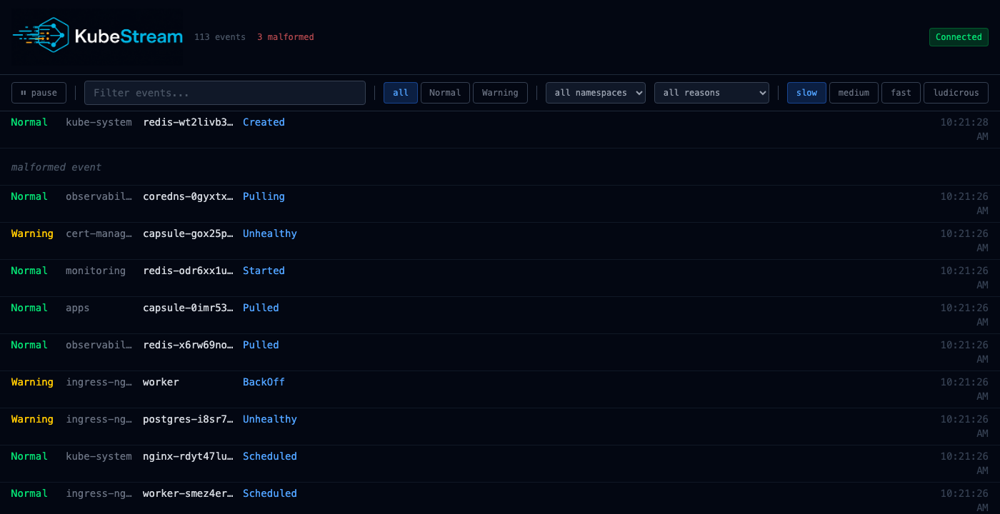

# KubeStream

A real-time viewer for Kubernetes events. It follows a live stream from a backend, lets you filter it, and copes with server restarts, broken payloads and page refreshes without losing events.



The frontend is in `app/` (React 19, TypeScript, Vite 8). `src/` holds a small backend that generates a fake event stream, with optional chaos: rate spikes, malformed payloads and simulated restarts.

## What it does

- Streams events over SSE and reconnects on its own, with exponential backoff.
- After a reconnect or a pause, fetches the events it missed from the REST cursor before showing new ones, so nothing is lost or shown twice.
- Filters by type, namespace and reason (the dropdowns fill up as events arrive), plus a case sensitive text search on name, namespace, reason, message and type.
- Shows any event as YAML, with copy to clipboard and prev/next through the other events of the same object (← and →, Esc to close).
- Switches the server rate between `slow`, `medium`, `fast` and `ludicrous`.
- Keeps the buffer and the cursor in IndexedDB, so a refresh picks up where you left off.
- Counts malformed events in the header and shows them as placeholder rows. They never crash the UI.
- Keeps the newest 2000 events in a virtualized list. At the top the list follows new events; scroll down and the rows you are reading stay still until you click "back to newest".

## Getting started

You need Node.js 22 or later and pnpm 10.

```sh
pnpm install

# terminal 1: backend on http://localhost:4000
pnpm start

# terminal 2: frontend on http://localhost:5173
cd app
pnpm dev
```

In development Vite proxies `/events` and `/config` to the backend. A production build has no proxy, so if the backend lives on another origin, set `VITE_SERVER_URL` when you build:

```sh
cd app
VITE_SERVER_URL=https://events.example.com pnpm build
```

For a same-origin deployment leave it unset. Any server that implements the API below will work.

## Backend

### API

| Method  | Path                           | Purpose                                                                             |
| ------- | ------------------------------ | ----------------------------------------------------------------------------------- |
| `GET`   | `/events/stream`               | SSE stream, one JSON event per message, event id as the SSE `id`                    |
| `GET`   | `/events?since=<id>&limit=<n>` | Page from the last 1000 events: `{ events, nextCursor }`, `limit` is 100 by default |
| `GET`   | `/config`                      | Current configuration                                                               |
| `PATCH` | `/config`                      | Change the configuration (also saved to `config.json`)                              |
| `GET`   | `/health`                      | Liveness probe                                                                      |

`since` returns the events after that id. If the id is no longer in the buffer, or comes from an earlier server process, you get the buffer from the oldest event. With nothing newer, `events` is empty and `nextCursor` is `since` again.

Only the two `/events` routes are required: `/config` is used by the rate selector and `/health` by the E2E suite.

A simulated restart takes the listener down for 5 seconds. The buffer and the ids carry on across it.

### Configuration

On first start `config.json` is copied from `config.example.json`.

```ts
type Config = {
  rate: "slow" | "medium" | "fast" | "ludicrous"; // about 1, 10, 30 or 60 events/s
  spikeProbability: number; // chance per second of a 10x burst, 0 to 1
  malformedProbability: number; // chance an event payload is corrupted, 0 to 1
  serverRestartIntervalSeconds: number; // mean seconds between restarts, 0 = never
};
```

```sh
curl http://localhost:4000/config

curl -X PATCH http://localhost:4000/config \
  -H 'Content-Type: application/json' \
  -d '{"rate": "fast", "malformedProbability": 0.1}'
```

Rate and probabilities change within 200 ms. A new restart interval reschedules the pending restart, and 0 cancels it. A patch with an unknown field or a value out of range gets a `400` and changes nothing.

The code is split into `main.ts` (startup and restarts), `http.ts` (routes), `feed.ts` (timer, ring buffer, subscribers), `catalog.ts` (fake objects and event templates), `corrupt.ts` (payload corruption), `config.ts` and `timing.ts`. `events.test.ts` checks the generated events against the frontend's Zod schema, so the two sides can't drift apart.

The backend is meant for development: it listens on all interfaces, accepts any CORS origin and `PATCH /config` has no authentication. Don't expose it to a network you don't trust.

## How the frontend works

`EventStreamClient` (`app/src/services/eventStream.ts`) owns the connection; `useEventStream` only connects it to the reducer.

When the stream drops, the client reconnects after 1 s, 2 s, 4 s and so on, up to 30 s. After 4 failures in a row the badge says Disconnected, and it stays that way while the client keeps trying.

After each connect, and when a pause ends, the client reads every `GET /events?since=<cursor>` page before committing live events. Live events that arrive meanwhile wait in a buffer, and the ones a page already delivered are dropped, so each event shows up once and in server order. If a page can't be fetched, the client drops the buffer and reconnects rather than skip the gap. A gap bigger than the server's 1000 events can't be recovered.

Live events are batched per animation frame: one dispatch per frame, whatever the rate.

All state lives in one `useReducer`, newest event first, capped at 2000. Anything coming from outside goes through Zod (`app/src/types.ts`): events, REST pages, `/config` and the IndexedDB snapshot. An event that fails becomes a malformed row; a snapshot that fails is thrown away.

`usePersistedEvents` restores the snapshot on mount, and the stream waits for it so the catch-up starts from the saved cursor. Then it saves at most once a second, and right away when the tab is hidden or closed.

Memoization is left to React Compiler. Rows are fixed at 52 px and show the first line of the message. An error boundary wraps the list and the modal; the stream sits above it and keeps running.

On accessibility: rows are buttons, so they work from the keyboard. The modal is a proper `role="dialog"` that takes focus, keeps Tab inside and gives focus back to the row on close. Filters have labels, toggle buttons use `aria-pressed`, and the connection badge is a `role="status"` region, so screen readers announce changes.

## Development

```sh
# backend
pnpm typecheck
pnpm format:check
pnpm test

# frontend
cd app
pnpm exec tsc -b
pnpm lint
pnpm format:check
pnpm test
pnpm build

# end-to-end, starts its own backends and frontends
pnpm test:e2e
```

Before the first E2E run, install the browser with `pnpm exec playwright install chromium`. The suite covers restart recovery, malformed events, the buffer cap and pause at `ludicrous`, the Disconnected state and scroll anchoring. It uses ports 4100, 4101, 5180 and 5181, and creates `config.json` for the run if you don't have one.

CI (`.github/workflows/ci.yml`) runs all of this on pushes to `main` and on pull requests.

## License

[MIT](LICENSE)
